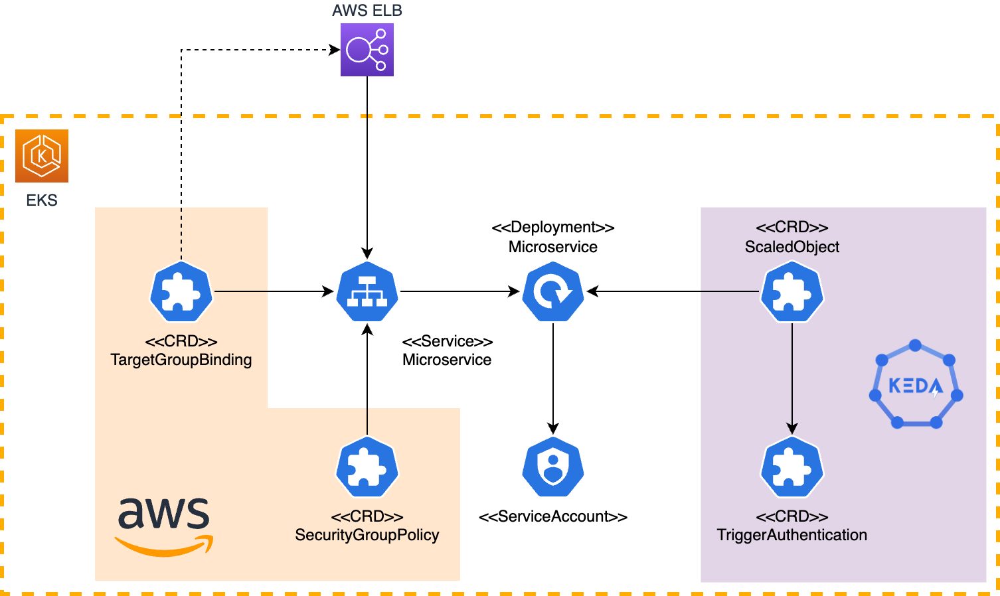

# K8s Microservice Template &middot; [](https://github.com/pagopa/eks-microservice-chart-blueprint/releases) [](https://github.com/pagopa/eks-microservice-chart-blueprint/issues) [](https://opensource.org/)

The `eks-microservice-chart-blueprint` chart is the best way to release your
microservice into PagoPA K8s environment. It contains all the required
components to get started, and it has several architectural aspects already
configured.

Some of the key benefits of this chart are:

- Enable security group per pods feature;
- Connect to your existing load balancer;
- Improved scalability and reliability thanks to **Keda**;
- Simpified way to setup secrets and configMaps.



## Changelog

see [CHANGELOG](CHANGELOG) to see the new features and the breking changes

### Static analysis

Install:

- <https://github.com/norwoodj/helm-docs>

## Installation

This is the official and recommended method to adopt this chart.

### Quick start

Create a `helm` folder inside your microservice project in which install the
Helm chart:

```shell
mkdir helm && cd helm
```

Add Helm repo:

```shell
helm repo add pagopa-eks-microservice https://pagopa.github.io/eks-microservice-chart-blueprint
```

> If you had already added this repo earlier, run `helm repo update` to retrieve
> the latest versions of the packages.

Add a very basic configuration in `Chart.yaml`:

```shell
cat <<EOF > Chart.yaml
apiVersion: v2
name: my-microservice
description: My microservice description
type: application
version: 1.0.0
appVersion: 1.0.0
dependencies:
- name: microservice-chart
  version: 1.0.0
  repository: "https://pagopa.github.io/eks-microservice-chart-blueprint"
EOF
```

Install the dependency:

```shell
helm dep build
```

Create a `values-<env>.yaml` for each environment:

```shell
touch values-dev.yaml values-uat.yaml values-prod.yaml
```

Override all values that you need, and form the root of your project install
the chart:

```sh
helm upgrade -i -n <namespace name> -f <file with values> <name of the helm chart> <chart folder>

helm upgrade -i -n mynamespace -f helm/values-dev.yaml mymicroservice helm
```

### Upgrading

Change version of the dependency and run the update:

```shell
cd helm && helm dep update .
```

## Template mandatory resources and configuration

To work as expect this template requires:

- Application has liveness and readiness endpoints;
- [Reloader](https://github.com/stakater/Reloader) or other tools that allow to restart pods when ConfigMap or Secret change;
- [Keda](https://github.com/kedacore/keda).

## Development

Clone the repository and run the setup script:

```shell
git clone git@github.com:pagopa/eks-microservice-chart-blueprint.git
cd eks-microservice-chart-blueprint.git
sh /bin/setup
```

### Warning

Setup script installs a version manager tool that may introduce
compatibility issues in your environment. To prevent any potential
problems, you can install these dependencies manually or with your
favourite tool:

- Helm 3.8.0

### Publish

The branch `gh-pages` contains the GitHub page content and all released charts.
To update the page content, use `bin/publish`.

## Known issues and limitations

- None.
